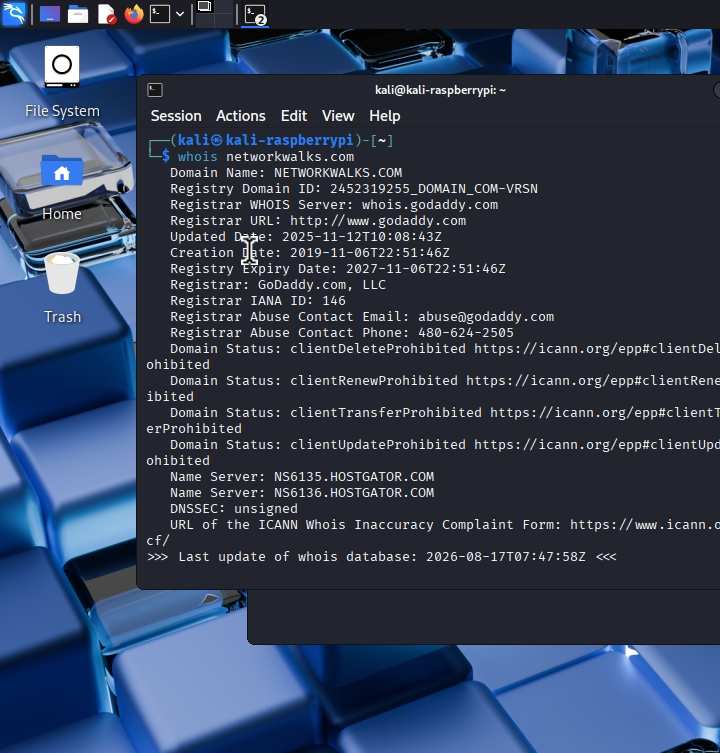
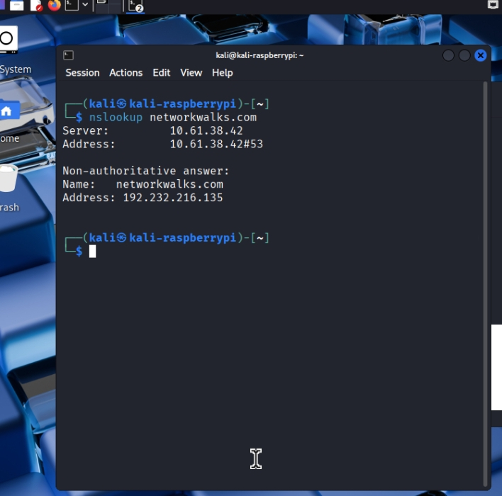
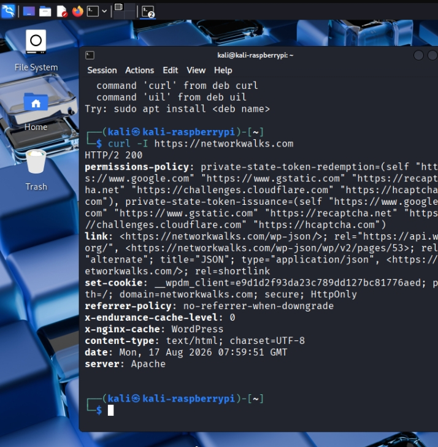
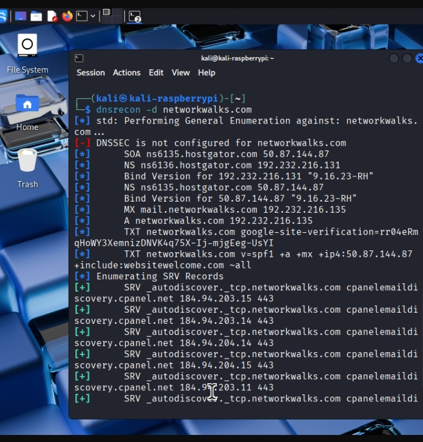

# 🔐 NetworkWalks – Module 1
## Cybersecurity Reconnaissance

**Authorized Target:** networkwalks.com  
**Training:** NetworkWalks Cybersecurity Training  
**Platform:** Kali Linux

---

## 1️⃣ WHOIS – Domain Information

WHOIS is used to collect publicly available domain information.

📄 **Command Output:**  
[View whois.txt](whois.txt)

🖼️ **Screenshot:**  

---

## 2️⃣ WhatWeb – Technology Detection

WhatWeb is used to identify technologies and web components used by the target website.

📄 **Command Output:**  
[View whatWeb.txt](whatWeb.txt)

🖼️ **Screenshot:**  

---

## 3️⃣ NSLookup – DNS Information

NSLookup is used to query DNS information and domain resolution details.

📄 **Command Output:**  
[View nslookup.txt](nslookup.txt)

🖼️ **Screenshot:**  

---

## 4️⃣ CURL – HTTP Information

CURL is used to send HTTP/HTTPS requests and inspect server responses.

📄 **Command Output:**  
[View curl.txt](curl.txt)

🖼️ **Screenshot:**  

---

## 5️⃣ WAFW00F – WAF Detection

WAFW00F is used to identify whether a Web Application Firewall may be protecting the website.

📄 **Command Output:**  
[View wafw00f.txt](wafw00f.txt)

🖼️ **Screenshot:**  

---

## 6️⃣ DNSRecon – DNS Reconnaissance

DNSRecon is used to gather publicly observable DNS information from the authorized target.

📄 **Command Output:**  
[View dnsrecon.txt](dnsrecon.txt)

🖼️ **Screenshot:**  

---

# ✅ Module 1 Completed

Six reconnaissance techniques were performed and documented with command outputs and screenshot evidence.

**Tools:** WHOIS • WhatWeb • NSLookup • CURL • WAFW00F • DNSRecon

**Author:** Nura Muhammad Ibrahim

**NetworkWalks Cybersecurity Training**
